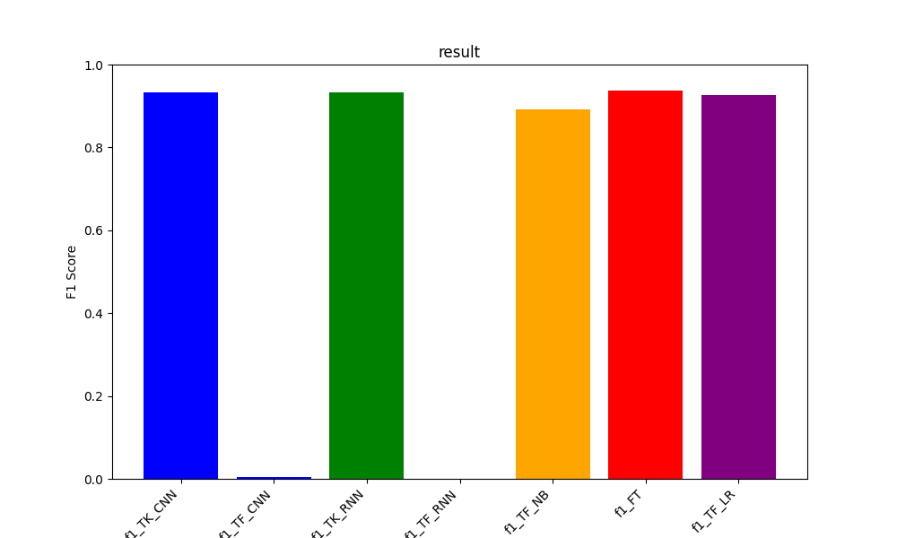

## 프로젝트 이름
메일함 정리 프로젝트

## 프로젝트 설명
어느새 쌓인 수십, 수백 개의 메일 중 중요 문서만 제외하고 삭제하는 프로그램을 구현하였습니다.

## 프로젝트 요약
- 데이터 수집 및 전처리: IMAP을 이용해 네이버 메일과 Gmail의 제목을 수집하고, 토큰화 또는 TF-IDF 방식으로 전처리를 진행했습니다.
- 모델 선택: 로지스틱 회귀, Naive Bayes, CNN, RNN 등 다양한 알고리즘을 실험하여 최적의 모델을 선정했습니다.
- 모델 훈련 및 평가: 선택한 모델을 훈련 데이터에 적합시키고, 검증 데이터를 사용하여 모델의 정확도와 성능을 평가했습니다.
- 하이퍼파라미터 튜닝: Hyperband, 베이지안 최적화, 그리드 서치 등을 활용하여 모델의 하이퍼파라미터를 조정했습니다.
- 모델 평가: 각종 모델을 테스트 데이터에 적용하여 F1-score를 평가하고, 최적의 모델을 선정했습니다.
- 프로그램 구현: 선정된 모델을 기반으로 메일함 정리 프로그램을 구현했습니다.

## 모델 평가

TK : Tokenizer //
TF : TF-IDF //
NB : Naive Bayes //
FT : FastText //
LR : Logistic Regression

## 프로그램 정보
